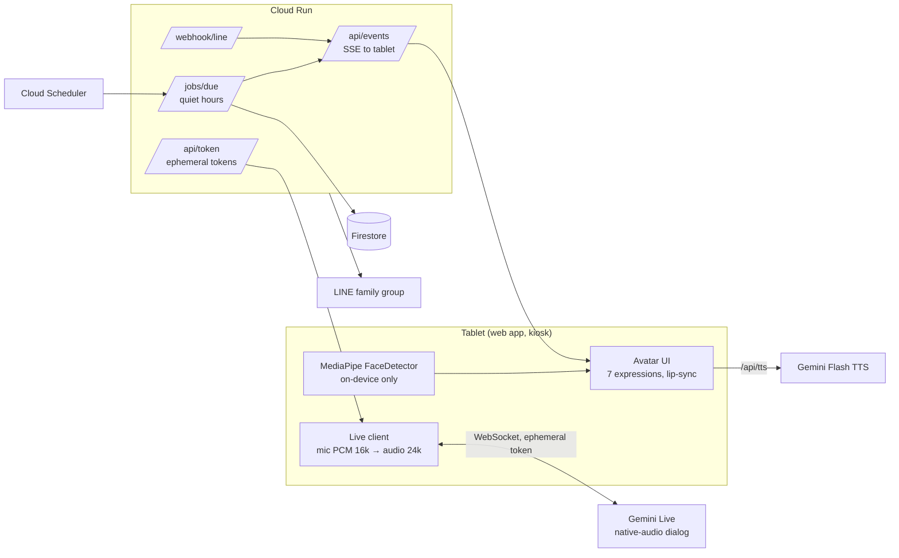

# ひなた (Hinata) — obasan

見守りアバター: a tablet companion avatar that talks by voice with elderly people
living alone in Japan. Hinata proactively checks in, reminds about medicine and
water, and alerts family by email (or LINE) when something seems wrong — an agent that
decides when to speak, when to sleep, and when to call the family, not a chatbot
waiting for questions.

Google Zen hackathon 2026 entry. Submission deadline: **2026-10-15**.

## Repo layout

| Path | What |
| --- | --- |
| `web/` | Tablet app (Android Chrome kiosk): avatar, MediaPipe presence, Gemini Live client, Wake Lock |
| `backend/` | Cloud Run service: agent logic, email/LINE family alerts, proactive-call triggers, static hosting of `web/` |
| `docs/` | [Design summary](docs/hinata-design.md) · [Architecture](docs/architecture.md) · [Deploy guide](docs/deploy.md) · [Demo script](docs/demo-script.md) · original [avatar demo](docs/koharu-avatar-demo.html) |

## How it works



Camera frames never leave the tablet; only a present/absent boolean is reported.
The Live session uses a short-lived **ephemeral token** minted by the backend, so
no API key ships to the device. When grandma is away for ~45 s the session closes
and Hinata sleeps — cost stays low; when she comes back, a fresh session resumes
with the stored conversation summary.

## Agent tools (declared to Gemini Live)

`set_emotion` (avatar face) · `notify_family` (email/LINE push) · `schedule_reminder`
· `get_weather_alert` · `save_memory` (conversation summary)

## Run locally

```bash
cd backend
cp .env.example .env   # fill in what you have — everything is optional
npm install
npm start              # → http://localhost:8080
```

With no env vars the app runs in **demo mode**: avatar, standby/calling state
machine, MediaPipe presence and LINE/tool stubs all work; voice falls back to
browser speech synthesis. Set `GEMINI_API_KEY` for real Gemini Live + TTS.

Deploy: see [docs/deploy.md](docs/deploy.md).

## Safety

- Camera frames processed on-device only (MediaPipe). No images are sent anywhere.
- LINE messages from family are treated as **data to relay**, never commands.
- A human (family) decides after alerts — the agent only notifies.
- Agent action log (Firestore / in-memory). Quiet hours 22:00–07:00 JST suppress reminders.
- No My Number or sensitive personal data collected.

## 3D avatar (VRM)

The tablet app renders a **3D VRM avatar** by default (three.js + `@pixiv/three-vrm`
via CDN import map — no bundler). `web/models/hinata.vrm` is the current model;
`web/models/neko.vrm` (**WeirdCat**, Polygonal Mind *100Avatars R3*,
[CC0](https://github.com/ToxSam/open-source-avatars)) is kept as an alternative
cat avatar — point `MODEL_URL` in `web/js/avatar3d.js` at it to switch. To use a
custom model, export a VRM from **VRoid Studio** (map the preset expressions
`happy`/`sad`/`angry`/`surprised`/`relaxed` + visemes `aa`/`ih`/`ou`/`blink`)
and point `MODEL_URL` at it. Features: audio-driven lip-sync, blinking, look-at wander,
idle sway, arm wave while calling, eyes-closed standby, mood expressions.
Fallbacks: `?avatar=svg` forces the SVG avatar; any VRM load failure (no WebGL,
missing file, offline CDN) silently stays on SVG. The キャラクター buttons switch
between 3D and SVG characters live.

## Song files

`web/audio/songs/*.mp3` are free traditional-song recordings (ふるさと,
ももたろう, おぼろづきよ, あめふり, さくら, ゆき — all public-domain
文部省唱歌/童謡) from [音楽研究所 / mu-tech.org](https://www.mu-tech.org/Traditional/).
Their terms allow free use as BGM in apps/videos for non-commercial purposes;
they may not be redistributed as music material by themselves. The うた chip
and the Live `play_song` tool play them while the avatar lip-syncs and shows
karaoke lyrics in the bubble.

## Submission checklist

- [x] Avatar demo: expressions, lip-sync, standby, proactive call
- [x] Repo scaffold + backend (token, SSE, LINE webhook, reminders)
- [x] MediaPipe face detection (on-device)
- [x] Gemini Live wiring (ephemeral token) — needs a funded API key
- [ ] Deploy to Cloud Run (needs GCP project) — see docs/deploy.md
- [ ] Family alerts: `SMTP_USER`/`SMTP_PASS`/`FAMILY_EMAIL` env vars (Gmail app password) — see docs/deploy.md
- [ ] ~3 min demo video — see docs/demo-script.md
